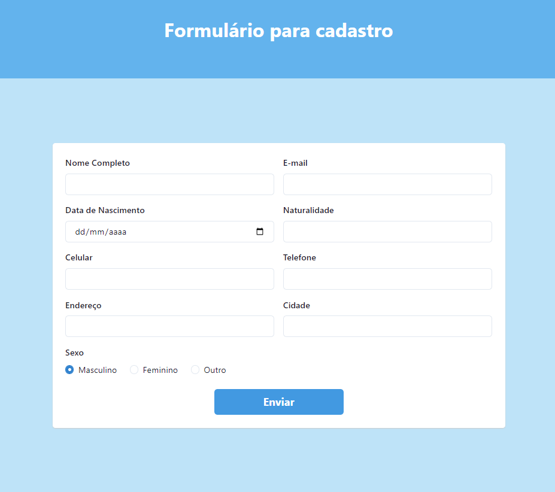
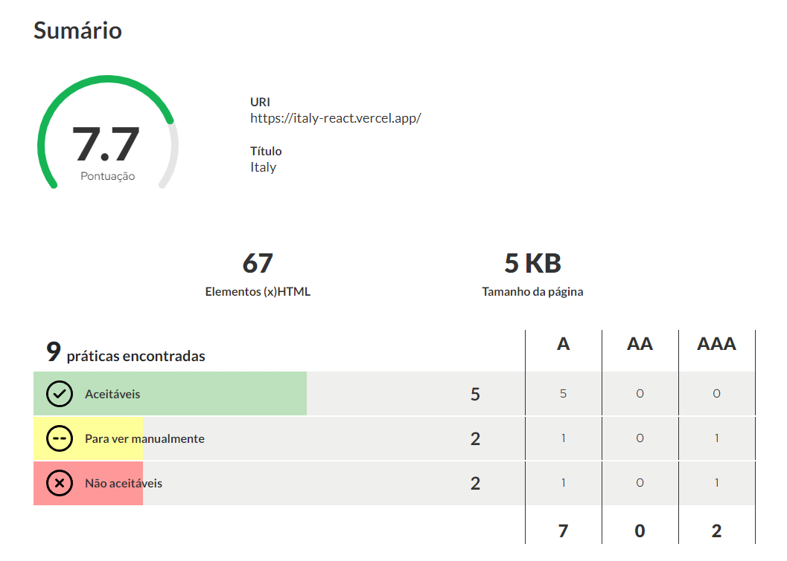

# Guia Turístico - Itália
Este projeto tem como principal objetivo a construção de um site de turismo/informativo sobre cidades italianas e a Itália, como um todo.

## Pacotes e Dependências

**Chakra Ui**: Uma biblioteca de componentes simples, modular e acessivel.
Emotion

**Emotion**: Biblioteca para escrever css com javascript

**Classnames**: Biblioteca de utilidade para usar condicionais em nomes de classes css

**Normalize**: Reseta o css, padronizando os navegadores

**React Icons**: Biblioteca de icones do react

**React Router Dom**: Biblioteca para roteamento declarado e encadeado

**DEV**:

**Eslint**: Ferramenta de análise de código estático para identificar padrões problemáticos.

## O Projeto
O Projeto possui:
- 5 páginas + 1 página de erro
- 4 Componentes
- Imagens de cada cidade e/ou região
- JSON com os dados utilizados na aplicação
Os arquivos do projeto foram divididos em pastas a fim de melhorar a organização e facilitar a manutenção do código.
Todas as páginas foram construídas com HTML **semântico**, recursos de **acessibilidade** e com foco na **usabilidade**.

### Inicio
Está página possui uma recomendação de 3 roteiros aleatórios. 
Possui a parte **"Nossa Casa"** a qual mostra uma imagem demonstrativa da itália e o "endereço" da empresa.
O componente `nav`, `footer` e `padrao`.

### Menu
Está página demonstra o roteiro completo. É a principal página do projeto, a qual concentra a maior parte de componentes e esforço.

Nesta página encontram-se todos os roteiros disponíveis, além de ser possível **buscar** um roteiro especifíco, **filtrar** por região e **ordenar** por quantidade de dias ou menor preço.

Além disso, é possível selecior um roteiro o qual o abre em uma página maior exibindo a descrição, região, duração e valor da viagem.

### Sobre
Página demonstrativa que faça sobre a empresa.

### Formulário
Formulário para cadastro de clientes.

## Acessibilidade

You can learn more about accessibility in a website in [Gov Accessibility](https://www.acessibilidade.gov.pt/).

The result abou the accessibility of this website is:

